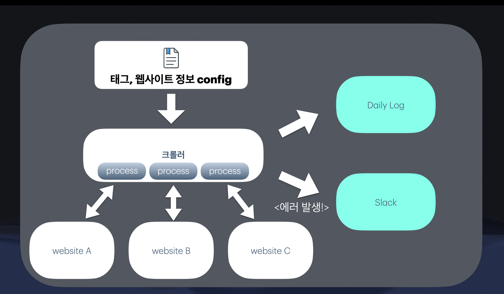

# What is this?
- 멀티 프로세싱 기반 뉴스 웹사이트 크롤러입니다.
- 4개의 웹사이트의 5만개의 뉴스기사를 초기 크롤링하는데 소요 시간 : 약 5시간
- 그 외 주기적으로 갱신 크롤링시 매일 약 1-2천개의 기사 추가됨 소요 시간 : 20분

## 아키텍쳐


# 기능
## Config
- 기존의 크롤링에서는 일일이 코드에서 태그를 찾아서 수정해주어야 했습니다
- 혹은 웹사이트내에서 태그가 변경되는 경우가 있었습니다. 
- 따라서 config파일을 이용해 쉽게 태그를 변경할 필요가 생겼습니다.
  다음과 같은 config를 이용해서 크롤링 정보를 입력받아
  일일이 코드에서 수정해줄 필요가 없게 만들었습니다.
- config 예)
```
{
	"html_tag": {
		"menu_list": ".gnb_m a",
		"sitemap": ".menu_list a",
		"article": ".cont_list a",
		"title": ".area_title > h3 ",
		"content": "#txt_area",
		"date": ".user_data"
	},
	"url_access": {
		"url": "https://www.asiae.co.kr/list/{high_cate}/{page}",
		"paging_mode": "All Page",
		"high_cate_idx": "0",
		"low_cate_idx": "0",
		"Start page": "1"
	}
}
```

## 크롤링
- 멀티 프로세스를 이용해서 빠르게 크롤링합니다
### 데이터 파싱
- 단지 뉴스 내용을 긁어오는 것이 아닌 분야 및 카테고리별로 나누어 저장합니다 다음의 정보를 구분하여 파일에 저장됩니다
- category
- sub_category
- title
- content

# 기술적 쟁점
## 어떻게 더 빠르게 크롤링할 것인지
### 크롤링 캐싱
- 기존 크롤링은 대상 웹사이트의 일부분을 크롤링해왔어도,  새로운 내용이 생겼을 경우 또 다시 중복된 크롤링을 하는 경우가 존재했습니다.
- 이를 방지하기 위해 파일로 웹사이트 uri를 저장하고 동일한 uri들은 생략할 수 있도록 구현하였습니다
### Kind Crawling
- sleep를 걸어두지 않고 크롤링하면 대상 웹사이트에 부하가 커질뿐만 아니라 block당하여 오히려 크롤링을 하지 못하는 문제가 생겼었습니다.
- 이에 무작위한 범위 내 sleep를 걸어두고 block 당하지 않도록 방지하였습니다.

## 어떻게 믿을 수 있는 크롤링을 제공할 것인가
### 로깅 
- 실패한 크롤링등 로깅하여 원인 파악할 수 있도록 제공
- 크롤링 완료 경과 로깅 제공

### 모니터링 및 알람
- 모니터링 및 알람 대상
  - 디스크에 용량 부족
  - 비정상적으로 크롤링에 실패하는 경우가 일정 횟수 이상 - 점검 요청 
  - 저장할려는 디스크의 용량이 부족할 것으로 예상되는 경우 알람
- 당일 완료된 크롤링 경과를 주기적으로 알람

    
